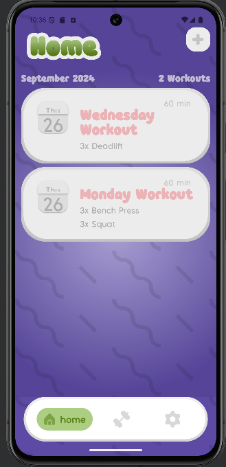
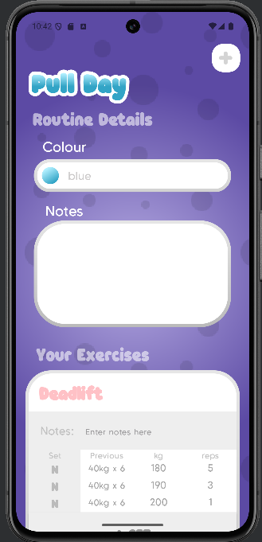
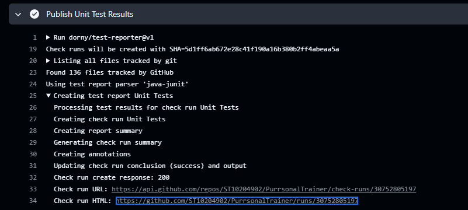

# Purrsonal Trainer

Purrsonal Trainer is a pawsome and interactive fitness tracker designed to help users log and manage their gym sessions. With Purrsonal Trainer, users can create custom workout routines, track their purr-formance, and view detailed meow-trics, such as which muscle groups they’ve clawed the most and their rep maxes for each exercise. Future updates will introduce ameowzing gamification, including a fully customizable cat avatar that evolves as the user paws through their workouts. Users will earn “experience points” and “milk coins” for purr-sisting in their fitness routine, which they can use to purr-sonalize and upgrade their feline friend. Upcoming features will include a fitter, fur-midable cat avatar that mirrors the user’s own purr-suit of fitness!

## Table of Contents

- [Purrsonal Trainer](#purrsonal-trainer)
  - [Table of Contents](#table-of-contents)
  - [Usage](#usage)
  - [Features](#features)
  - [Configuration](#configuration)
  - [Credits](#credits)
  - [Testing](#testing)
  - [Style Guide](#style-guide)
    - [Classes](#classes)
      - [Naming](#naming)
      - [organization](#organization)
      - [Notes](#notes)
    - [Methods](#methods)
      - [naming](#naming-1)
      - [Modifiers](#modifiers)
      - [length](#length)
    - [Comments](#comments)
    - [KDoc or Summaries](#kdoc-or-summaries)
      - [End of file](#end-of-file)
      - [Parameters](#parameters)
      - [constructors](#constructors)
      - [methods](#methods-1)
      - [section starts and ends](#section-starts-and-ends)
    - [Usage](#usage-1)

## Usage

## Features

Users Have the option to sign in with google SSO


Users can view their previous workouts at a glance in the home page



The routines page lets you save custom workout routines that can be started at any time!
you can also modify these routines on the fly.




## Configuration

The app has multi-language support and can be used in Afrikaans by changing your devices language settings

## Credits

This project would never have been possible without our legendary project manager Anneme Holzhausen who also designed the entire UI!

Testing was implemented by the formidable Nicholas Meyer who had to deal with all but untestable code. He also took on implementing the settings page as well as the graph and RM section.

Speaking of untestable code was the backend UserManager that allows the app to interface seamlessly with Firebase Realtime database and was implemented by Michael French (and other than being difficult to test didn't break once throughout the project!)

login and registration as well as middleware was tackled by the dedicated efforts of Jasper Van Niekerk.

And finally, the man holding the entire fort together the true Renaissance man Joshua "joshy squashy" Harvey took on the tasks that no one else could handle.

## Testing

We have used GitHub actions to automate testing of some of our key classes. As of right now, instrumented tests are not implemented as they are not available through a free plan on GitHub actions or via Firebase Labs. These unit tests do test key functionalities of the app such as the Validator class and WorkoutWorker class.

Our action flow runs on trigger whenever there is a push or successful pull request on dev or main. The following unit test job occurs on that trigger.

The first section includes setting up the workflow by checking out our repository, installing JDK 17 and installing the Android SDK. (Step 1 - 3)

The next section includes adding the platform tools required for the app, checking our cache for gradle and android dependencies. Then enabling the gradle daemon and downloading dependencies. (Step 4-9)

After all setups are complete, the project is built with gradle. The unit tests are run and the results are uploaded as a unit test artifact to our app/build/test-results folder. (Step 10-13)

After the tests have passed or failed, a test reporting plugin is used to generate easy to read test summaries that state which tests passed or failed and any other important information. (Step 14)

It is also important to note that pull requests from dev on to main will never be allowed if tests fail. This prevents us from putting bad production code in a final submission.


Automated testing using github actions runs whenever something is pushed to main


## Style Guide

Outline any code style conventions, naming conventions, or design principles followed in the project.

### Classes

#### Naming

class naming convention should be pascal case
example: MySuperCoolClass

#### organization

classes should be organized as follow:

1. public properties
2. private properties
3. constructor
4. public methods
5. private methods

#### Notes

- group methods by functionality
- classes should not be to big and only have one responsibility

### Methods

#### naming

method names should be camel case
method names should also be verb based
example: calculateTotalAmount

method parameters should be named descriptively to clarify its role.

#### Modifiers

use private where possible
use internal for both classes and methods that are only needed within the module.

#### length

Methods should only do one thing
Methods should ideally not be longer than 20 lines

### Comments

Comments should explain why something is done not how something is done
avoid redundant comments

```kotlin
// BAD: This comment just restates what the code does
// Add 5 to total
total += 5
// GOOD: This comment explains the reasoning behind the action
// Adding shipping cost to the total purchase amount
total += shippingCost
```

Use TODO to mark future work needed to be done

```kotlin
// TODO: Handle edge case for negative amounts
```

### KDoc or Summaries

kdoc starts with /\*_ and ends with _ /
use tags:

- @param
- @return
- @throws

```kotlin
/**
 * Handles all user-related operations, including authentication
 * and account management.
 *
 * @property userRepository The repository used to access user data
 */
class UserManager(private val userRepository: UserRepository) {
    // Class implementation
}

/**
 * Calculates the total price of items in the cart, including taxes.
 *
 * @param items List of items in the shopping cart.
 * @param taxRate The tax rate to be applied to the total.
 * @return The total price of the items, including taxes.
 */
fun calculateTotal(items: List<Item>, taxRate: Double): Double {
    // Function implementation
}

/**
 * Sets the user password after validating its strength.
 *
 * @param password The password to be set. Must be at least 8 characters long.
 * @throws IllegalArgumentException if the password is weak.
 */
fun setPassword(password: String) {
    // Function implementation
}

/**
 * Sets the user password after validating its strength.
 *
 * @param password The password to be set. Must be at least 8 characters long.
 * @throws IllegalArgumentException if the password is weak.
 */
fun setPassword(password: String) {
    // Function implementation
}

/**
 * Connects to a remote server.
 *
 * @throws IOException if there is an error connecting to the server.
 */
fun connectToServer() {
    // Implementation
}

```

#### End of file

```kotlin

//------------------------***EOF***-----------------------------//
```

#### Parameters

```kotlin
//                          PROPERTIES                       //
```

#### constructors

// CONSTRUCTORS //

```kotlin

//                          CONSTRUCTORS                       //
```

#### methods

```kotlin
//                          METHODS                          //
```

#### section starts and ends

```kotlin
//-----------------------------------------------------------//
```

### Usage

so when starting a section at the top of a document you'll give the heading of the section followed by the line of dashes to indicate the start of the section.

for instance:

```
//                          METHODS                          //
//-----------------------------------------------------------//
```

this is what a section heading with no other headings above it would look like.

sub sections are titles with a capital letter at the start of each word and spaces between words
they also are left aligned instead of centred.

```
// Authentication Methods
//-----------------------------------------------------------//
```

in this example the Authentication methods would come after the METHODs title. NOTE: there is no //--// line above the Authentication Methods heading because that would indicate the end of the methods section!!!

think of the //----// as brackets. you can nest them!

if you added another methods section underneath the authentication section it would have both an opening and closing line:

```
//-----------------------------------------------------------//
// Validation Methods
//-----------------------------------------------------------//
```
